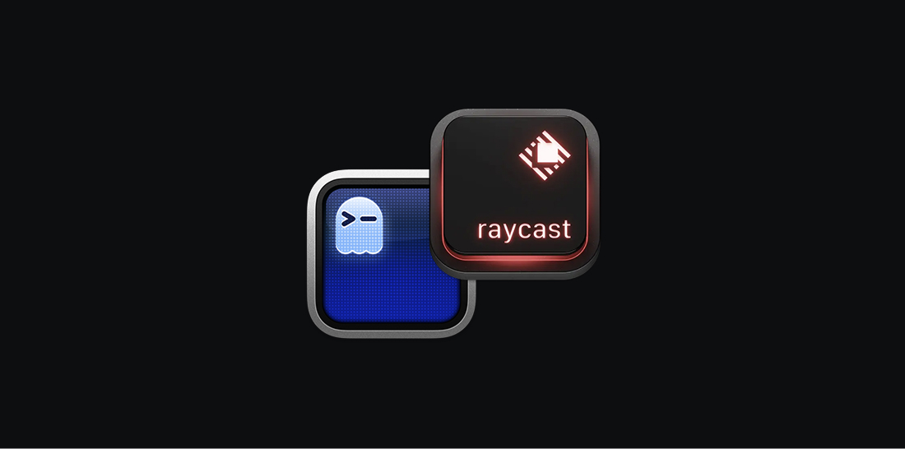

# Ghostty Layouts for Raycast



A powerful Raycast extension that brings terminal layout management to [Ghostty](https://ghostty.org/). Create, manage, and launch complex terminal layouts with ease, featuring AI-powered layout generation and intuitive repository selection.

## Features

### 🚀 Quick Layout Management
- **Launch Layouts**: Instantly create predefined terminal layouts with multiple panes and commands
- **Browse Repositories**: Navigate through your development directories with an intuitive picker
- **AI Layout Builder**: Generate custom layouts using natural language descriptions via OpenAI

### 🔧 Layout Capabilities
- **Split Panes**: Create horizontal and vertical splits with specific commands
- **Working Directories**: Set different working directories for each pane
- **Complex Nested Layouts**: Support for deeply nested splits and sophisticated arrangements
- **Predefined Commands**: Launch editors, servers, build tools, and more with a single command

### 🎯 Built for Developers
- **Git Repository Detection**: Automatically identifies and highlights Git repositories
- **Developer Workflow Integration**: Perfect for launching development environments
- **Customizable Preferences**: Configure your developer folder and OpenAI API key

## Installation

1. Install [Ghostty](https://ghostty.org/) terminal emulator
2. Install this extension from the Raycast Store or build from source
3. Configure your preferences in Raycast Settings

## Configuration

### Required Preferences
- **Developer Folder**: Path to your main development directory (e.g., `~/Developer`)

### Optional Preferences  
- **OpenAI API Key**: Required only for AI Layout Builder feature

### Ghostty Configuration
For optimal experience, add these settings to your Ghostty config (`~/.config/ghostty/config`):

```
# Enable working directory inheritance (experimental)
window-inherit-working-directory = true
shell-integration = zsh

# Optional: Show working directory in window title
window-title = working-directory
```

## Usage

### Creating Layouts

#### Method 1: Manual Layout Creation
1. Open Raycast and search for "Manage Layouts"
2. Click "Add New Layout" 
3. Define your layout structure with splits and commands
4. Save and name your layout

#### Method 2: AI Layout Builder
1. Open Raycast and search for "AI Layout Builder"
2. Describe your desired layout in natural language
3. The AI will generate a complete layout configuration
4. Review, modify if needed, and save

### Launching Layouts
1. Open Raycast and search for any of your saved layouts
2. Select the repository/directory where you want to launch the layout
3. The extension will create the terminal layout with all specified panes and commands

## Example Layouts

### Full-Stack Development Layout
```json
{
  "name": "Full-Stack Dev",
  "structure": {
    "direction": "horizontal",
    "panes": [
      {
        "direction": "vertical", 
        "panes": [
          { "command": "nvim" },
          { "command": "npm run dev" }
        ]
      },
      {
        "direction": "vertical",
        "panes": [
          { "command": "git status" },
          { "command": "npm run test:watch" }
        ]
      }
    ]
  }
}
```

### Simple Three-Pane Layout
```json
{
  "name": "Editor + Server + Logs",
  "structure": {
    "direction": "vertical",
    "panes": [
      { "command": "nvim" },
      {
        "direction": "horizontal",
        "panes": [
          { "command": "npm start" },
          { "command": "tail -f logs/app.log" }
        ]
      }
    ]
  }
}
```

## AI Layout Builder Examples

You can describe layouts in natural language:

- *"Create a layout with nvim on the left and two terminals on the right for running tests and git commands"*
- *"I need a React development setup with editor, dev server, test runner, and git status"*
- *"Make a Python layout with editor on top, interpreter on bottom left, and file watcher on bottom right"*

## Commands Reference

All layout commands are executed in the selected repository directory. Common commands include:

- **Editors**: `nvim`, `code`, `vim`
- **Development**: `npm run dev`, `npm start`, `yarn dev`
- **Testing**: `npm test`, `jest --watch`, `pytest`
- **Version Control**: `git status`, `git log --oneline`
- **Build Tools**: `npm run build`, `make`, `cargo run`
- **Monitoring**: `tail -f logs/app.log`, `htop`

## Development

### Prerequisites
- Node.js 18+
- Raycast (for testing)
- Ghostty terminal

### Setup
```bash
git clone https://github.com/thalysguimaraes/ghostty-layouts-raycast
cd ghostty-layouts-raycast
npm install
npm run dev
```

### Building
```bash
npm run build
```

### Project Structure
```
src/
├── manage-layouts.tsx      # Main layout management interface
├── ai-builder.tsx         # AI-powered layout generation
├── launch-layout.tsx      # Layout launching logic
├── repo-picker.tsx        # Repository selection interface
├── utils.ts               # Core Ghostty integration utilities
└── types.ts               # TypeScript type definitions
```

## Contributing

Contributions are welcome! Please feel free to submit a Pull Request. For major changes, please open an issue first to discuss what you would like to change.

### Development Guidelines
- Follow existing code style and patterns
- Add tests for new functionality
- Update documentation for any new features
- Ensure TypeScript types are properly defined

## License

MIT License - see [LICENSE](LICENSE) file for details.

## Credits

- Built for [Ghostty](https://ghostty.org/) by Mitchell Hashimoto
- Powered by [Raycast](https://raycast.com/)
- AI functionality powered by [OpenAI](https://openai.com/)

## Support

If you encounter any issues or have feature requests, please open an issue on GitHub.

---

**Made with ❤️ for terminal enthusiasts and productivity nerds**
